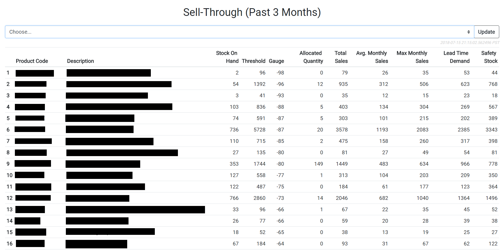

# reorder-app
Table showing important numbers used in production operations such as low stock counts of products, lead time demand, allocated sales quantities, and more. The user can choose the historical sell-through of the past three, six, or 12 months. The data is pulled from Unleashed Inventory Management System.

## Technology Stack:
Python 
Flask framework 
Javascript 
HTML/CSS/Bootstrap 
SQlite 
MongoDB

## License
[MIT](LICENSE) © Justin Le